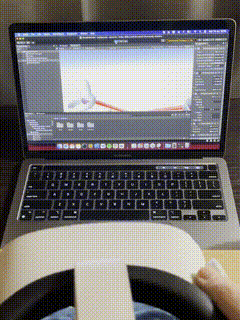
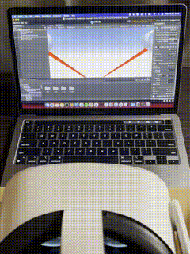

# Oculus Linkintosh




There's no support for Oculus Quest 2 (and the old one) on Mac for development.
The only way to test your game is to build and run directly on your headset, so inconvenient.

The aim of Linkintosh is to run the project directly into the Unity editor, using your headset/controllers as input on MacOS/Linux.

## How it works

### Server

Build and run the project directly into your headset, it will silently start a local websocket server (`LTServer.cs`).

### Client

The stream will be received by the client and instead of manipulating the anchors, will simulate an XR device.
It takes advantages of the new Input System, so if your project is using the old system, unfortunately there's no support at the moment. 

Anyway, should not be difficult to make a proper adapter and make it working with your project.
Manipulating the anchors is definitely possible, take a look to the `LTClient.cs`.

1. Copy the folder `Scripts/Client` and `Scripts/Models` into your project
2. Attach `LTClient.cs` and `LTDeviceSimulator` to an object
3. Setup the `LTDeviceSimulator` reference into `LTClient.cs`
4. Type the server URL (ws://your.headset.local.address:8080) (eg: ws://10.0.0.8:8080)

And you are ready to go, open the app on the headset and press play on Unity.

It supports:

XR Position/rotation:
- Headset (CenterEyePosition/CenterEyeRotation)
- Right controller (DevicePosition/DeviceRotation)
- Left controller (DevicePosition/DeviceRotation)

XR Generic Inputs:
- PrimaryButton
- PrimaryTouch
- SecondaryButton
- SecondaryTouch
- GripButton
- TriggerButton
- MenuButton
- Primary2DAxisClick
- Primary2DAxisTouch
- Secondary2DAxisClick
- Secondary2DAxisTouch
- UserPresence

## Compatibility

I own the Oculus Quest 2, but it should work with all the Open XR headsets.

I haven't tried on Linux yet, but it should work there as well. The websocket client is based on `System.Net.WebSockets.ClientWebSocket`.

## Video Streaming

The streaming from the Unity editor is not supported yet, but seems feasible using [Unity Render Streaming](https://github.com/Unity-Technologies/UnityRenderStreaming), if you are willing to help, just open a PR. Cheers.

## Beyond Unity

The server creates a websocket server, so theoretically any app can connect and receive the data. It can be adapted to another editor or app, using the data streamed from the headset into your app.

A sample JSON:

```JSON
{
  "headset": {
    "position": {
      "x": 0,
      "y": 0,
      "z": 0
    },
    "rotation": {
      "x": 0,
      "y": 0,
      "z": 0,
      "w": 1
    }
  },
  "rightHand": {
    "position": {
      "x": 0,
      "y": 0,
      "z": 0
    },
    "rotation": {
      "x": 0,
      "y": 0,
      "z": 0,
      "w": 1
    }
  },
  "leftHand": {
    "position": {
      "x": 0,
      "y": 0,
      "z": 0
    },
    "rotation": {
      "x": 0,
      "y": 0,
      "z": 0,
      "w": 1
    }
  },
  "leftInput": {
    "buttons": 0,
    "axis2D": {
      "primary": {
        "x": 0,
        "y": 0
      }
    },
    "trigger": {
      "index": 0,
      "hand": 0
    }
  },
  "rightInput": {
    "buttons": 0,
    "axis2D": {
      "primary": {
        "x": 0,
        "y": 0
      }
    },
    "trigger": {
      "index": 0,
      "hand": 0
    }
  }
}

```

N.B: The `buttons` represents the state of the buttons/touches on the controller, using bitwise operations. Please refer to `LTUtils.cs` in order to understand the mapping.
